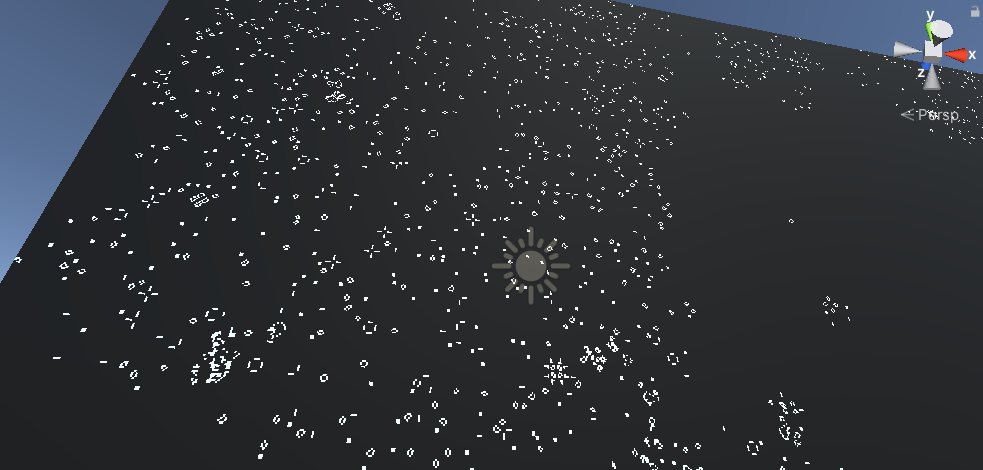
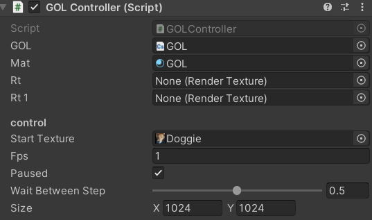

# Compute Shader Powered Game of Life

###### I saw a bunch of Unity videos by [Sebastion Lague](https://www.youtube.com/c/SebastianLague), he uses compute shaders a lot to process or pre-process data. So i wanted to try something similar

###### Above is the editor view of the Game of Life controller script
###### You can set the starting texture and how big the canvas should be
###### You can pause it and change how long it should wait before doing the next step
###### And lastly you can see the framerate of the shader
